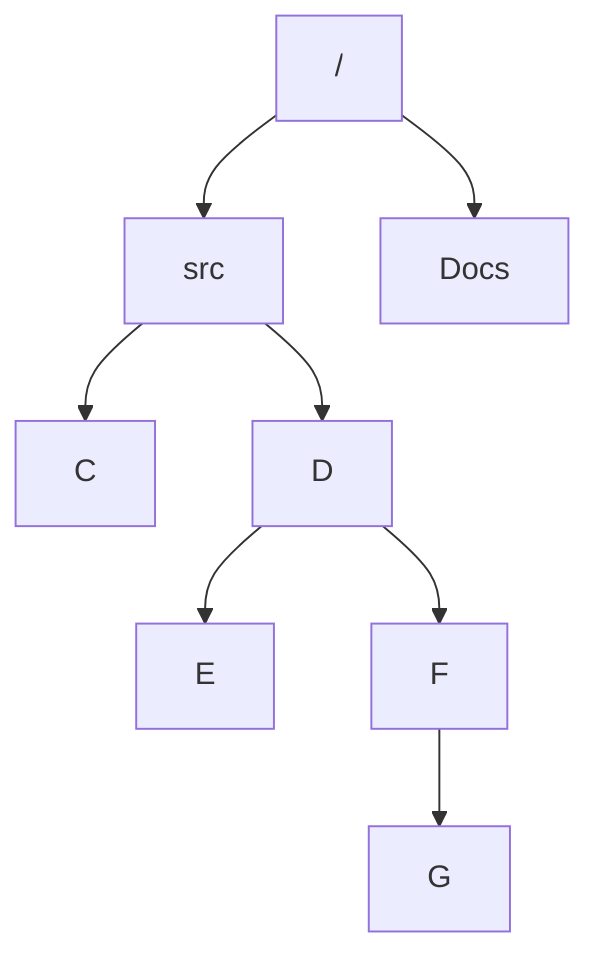
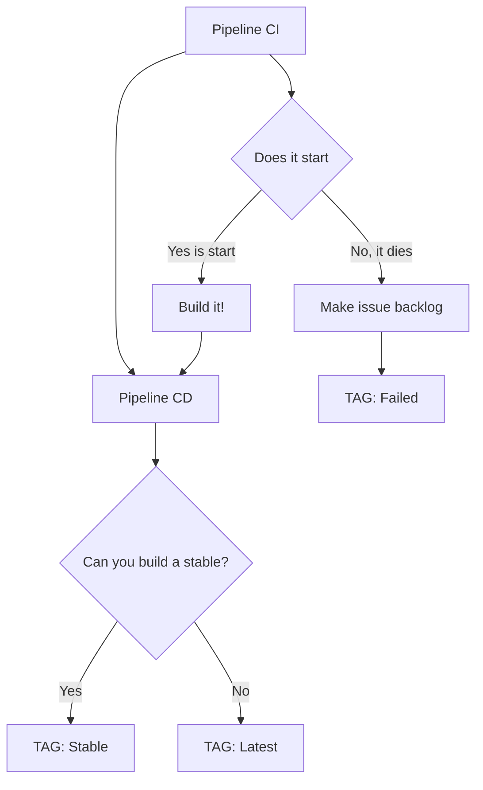

# testing-grounds

```mermaid
graph TD;
a["/"]
b[src]
c[C]
d[D]
e[E]
f[F]
g[G]
h[Docs]

a-->b-->c

b-->d-->e

d-->f-->g

a-->h


```

```mermaid
graph TD;
tag_a["TAG: Latest"]
tag_b["TAG: Stable"]
tag_c["TAG: Failed"]

CI["Pipeline CI"]-->CD["Pipeline CD"]

CI-->issue1{Does it start}
issue1--"Yes is start"-->build[Build it!]-->CD
issue1--"No, it dies"-->make[Make issue backlog]-->tag_c
CD-->mark{"Can you build a stable?"}
mark--"Yes"-->tag_b
mark--"No"-->tag_a
```

